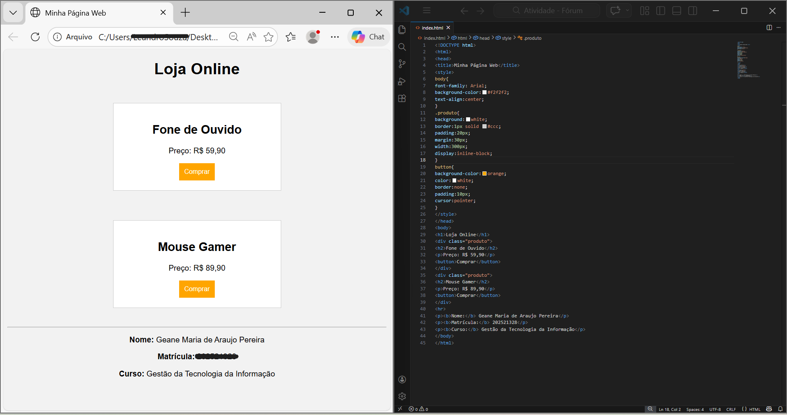

# Atividade de Análise de Interface - Faculdade Projeção

Este projeto consiste em uma análise crítica da interface da Shopee, focando em Design Limpo e experiência do usuário (UX).

## 🛠 Tecnologias utilizadas:
- HTML5 (Estrutura semântica)
- CSS3 (Estilização e Box Model)
- Visual Studio Code

## 📸 Resultado:

